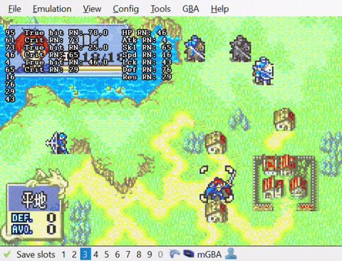
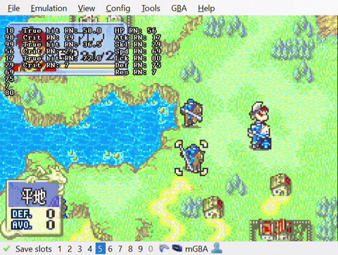

<h1> FE6 Bizhawk RNG Lua Script </h1>
An lua script that displays the future sequence of random numbers generated by FE6's deterministic RN generator.

<h2>Setup</h2>
Requires Bizhawk and a legally-sourced ROM for Fire Emblem - Fuuin no Tsurugi.
 
Open up Fire Emblem - Fuuin no Tsurugi in Bizhawk, and then in Bizhawk go to Tools > Lua Console > Script > Open Script, and open the rng.lua file.

<h2>Usage</h2>
When the script is opened, three columns will be displayed, from left to right:
 
1. List of future RNs - a list of the next 10 random numbers.  
2. Hit/Crit check - a list of RNs determining true hit and critical rate for the next 3 attacks.  
3. Growth rate check - a list of RNs determining level-up growths after one attack.  

 
An easy way to visualize the RNs is with "cursor-dancing". By moving the cursor in a way such that the cursor path needs to be recalculated, we can use up a random number and increment the RN list. In the example below, the path should go left then down for RNs >= 50, and down then left for RNs < 50.

    
     
    <em>You can see each RN list progress with each 1-RN burn cursor dance.</em>

RNs are used to determine results based on a comparison. If the random number is <strong>lower</strong> than the number needed, then the event is successful. Here's an example with a levelup.

    
     
    <em>A level-up after combat.</em>

<table align = "center">
  <tr>
    <th>Growth</th>
    <th>HP</th>
    <th>Str</th>
    <th>Skl</th>
    <th>Spd</th>
    <th>Lck</th>
    <th>Def</th>
    <th>Res</th>
  </tr>
  <tr>
    <td>Alen</td>
    <td style = "color: green">85</td>
    <td style = "color: green">45</td>
    <td style = "color: green">40</td>
    <td style = "color: red">45</td>
    <td style = "color: red">40</td>
    <td style = "color: red">25</td>
    <td style = "color: green">10</td>
  </tr>
  <tr>
    <td>RN</td>
    <td style = "color: red">56</td>
    <td style = "color: red">17</td>
    <td style = "color: red">29</td>
    <td style = "color: green">69</td>
    <td style = "color: green">80</td>
    <td style = "color: green">75</td>
    <td style = "color: red">7</td>
  </tr>
</table>

Since Alen's growth rates in HP, Strength, Skill, and Resistance are greater than the random number used for that stat during level up, we should see those stats increase. Looking at the gif above, that is indeed the behavior we see; Alen engages in combat and levels up, gaining 1 point in each of HP, Str, Skl, and Res.
